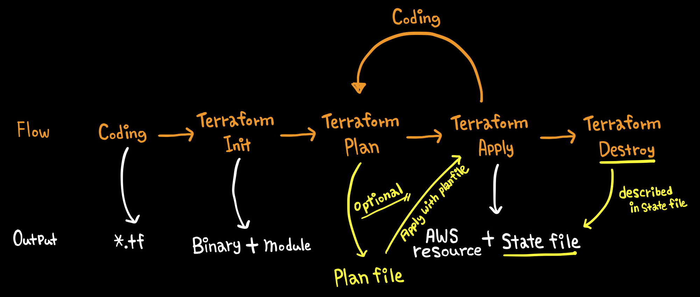
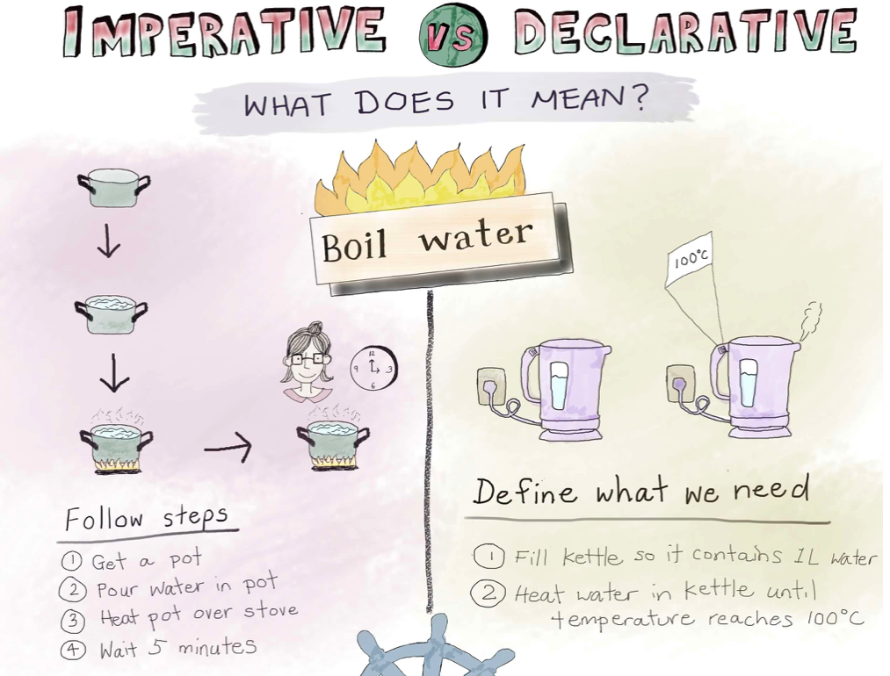
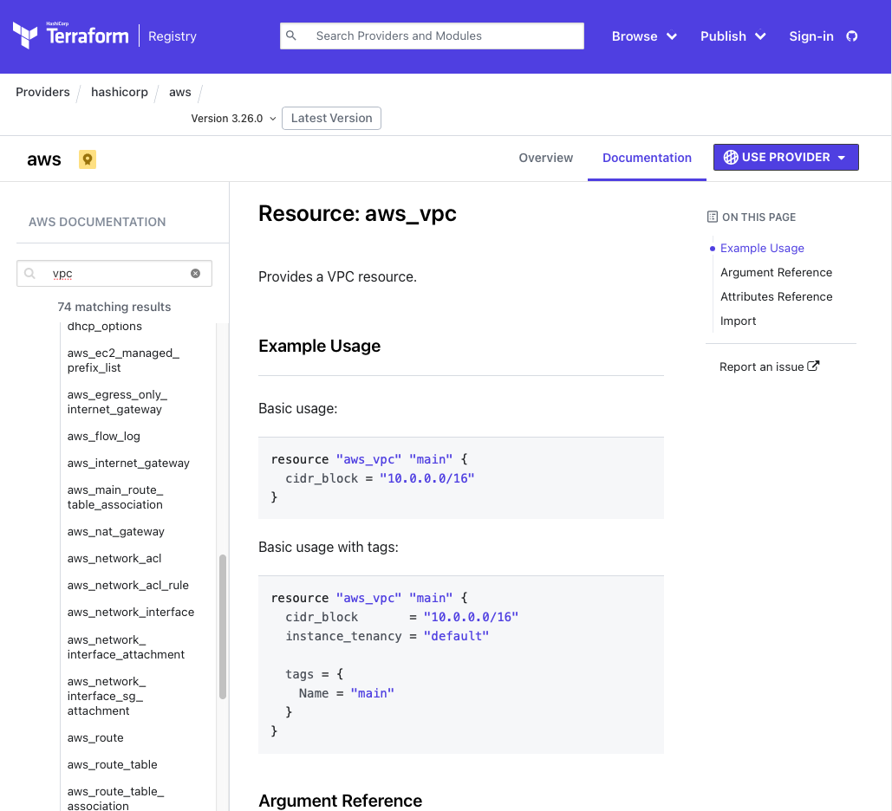

[toc]

# Overview

Terraform은 Hashicorp에서 배포중인 IaC 도구입니다. 홈페이지에서는 다음과 같이 소개하고 있습니다.

> Terraform is a tool for building, changing, and versioning infrastructure safely and efficiently. Terraform can manage existing and popular service providers as well as custom in-house solutions.

[Terraform by HashiCorp](https://www.terraform.io)

## [IaC(Infrastructure as Code)](https://ko.wikipedia.org/wiki/코드형_인프라스트럭처)

IaC는 인프라에 대한 관리 및 리소스의 프로비저닝(생성)을 코드로 진행하는 방식을 의미합니다. 이는 코드 작성과 관리에 대한 수 많은 방법론과 솔루션을 인프라에도 적용할 수 있는 이점이 있습니다. 특히, 인프라 형상의 변경이 비교적 잦은 클라우드 환경에서 각광 받고 있으며 다음과 같은 다양한 도구들이 사용되거나 CSP에서 제공되고 있습니다.

- [Terraform](https://www.terraform.io) (멀티클라우드)
- Opensatck Heat (멀티클라우드)
- [AWS Cloudformation](https://aws.amazon.com/cloudformation/) (AWS only)
- [Azure Resource manager](https://docs.microsoft.com/en-us/azure/azure-resource-manager/management/overview) (Azure only)
- [Cloud Deployment Manager](https://cloud.google.com/deployment-manager/) (GCP only)
- ...

[[기획특집] 'IaC', 효율적인 클라우드 인프라 운영의 핵심으로 떠오른다](https://www.comworld.co.kr/news/articleView.html?idxno=50114)

## Official Documents

Hands-on에서 다루지 못한 상세한 내용은 다음의 공식 문서를 참조하시길 바랍니다.

[Documentation - Terraform by HashiCorp](https://www.terraform.io/docs/index.html)

## Terraform workflow

일반적으로 Terraform을 통한 AWS 리소스 생성 및 수정, 제거에 대한 절차 및 절차별 산출물에 대한 내용입니다.



1. **HCL(Hashicorp Configuration Language) 문법을 따르는 코드를 작성하여 `.tf` 확장자를 가지는 파일로 저장**
    - 일반적으로, 코드는 가독성 및 목적에 따라 여러 파일(`.tf`)로 분할하여 관리합니다. 주의할 점은 Terraform은 디렉토리 단위로 동작하므로 여러 파일로 분할되었더라도 반드시 동일 디렉토리에 존재해야합니다.
2. **저장된 코드가 있는 디렉토리에서,  `terraform init` 명령어 실행**
    - 전체 코드를 분석한 다음, 어떤 provider와 (Child) Module을 사용하는지 식별하여 관련된 파일들을  `.terraform` 디렉토리에 다운로드합니다.
3. **이어서, `terraform plan` 명령어 수행**
    - 실제로 인프라에 적용하지는 않았으나 어떤 리소스가 어떻게 생성될지 예측하여 콘솔에 출력해줍니다.
    - 하지만 `plan`이 정상적으로 수행됨이 다음의 `apply` 과정에서 정상적으로 수행될 것임을 보장하지는 않습니다.

    예를 들어, AWS에서는 Subnet은 1개의 Route-table에만 연결될 수 있는 제한이 있습니다. 하지만, 코드에 하나 이상의 Route-table에 연결되도록 코드를 작성시에 `plan`은 정상적으로 수행되지만 `apply` 과정에서 에러가 발생합니다.

4. **이어서, `terraform apply` 명령어 수행**
    - 실제 인프라에 적용합니다. 그리고 결과 값(인프라 형상)을 `state` 파일에 저장합니다.
    - `state` 파일은 기본적으로 현재 디렉토리에 저장되지만 설정을 통해 S3나 Git을 통해 저장(관리) 할 수 있습니다.
5. **생성된 AWS 리소스를 삭제하고 싶은 경우 `terraform destroy` 명령어 수행**
    - `state` 파일에 명시된 인프라 리소스들에 대해서 삭제합니다.

## Provider

Terraform 자체는 인프라가 구축되는 환경(AWS, GCP, Azur 등)에 맞는 정보를 가지고 있지는 않습니다. Provider라는 일종의 플러그인을 통해서 그 정보를 활용하는 방식입니다. 이 때문에, `terraform init` 과정에서 어떤 provider가 필요한지 식별하여 관련된 파일을 다운로드하게됩니다.

현재 Terraform에서 활용할 수 있는 provider에 대한 모든 정보는 `Terraform Registry`에서 확인할 수 있습니다. 각각의 provider는 버전 정보를 가지고 있으며 신규 서비스 출시 혹은 버그 패치 등에 따라 버전이 올라가고 있습니다.

[](https://registry.terraform.io/browse/providers)

더욱 중요한 점은 리소스를 생성할 때, 어떻게 코드를 작성해야되는지에 대한 상세한 정보와 예시도 확인할 수 있어 꼭 확인하시어 구조를 익혀두시는게 좋습니다.

## Module

하나의 모듈은 동일한 디렉토리에 있는  코드(`.tf`)의 집합입니다. 모듈은 다른 모듈에 의해 호출될 수 있다보니, 코드의 재사용과 패키징의 주된 방법으로 사용됩니다. 모듈은 크게 Root module과 Child module로  구분합니다.

- Root module : terraform을 실행하고 있는 디렉토리(Working-directory)에 있는 코드의 집합
- Child modue :  다른 모듈(일반적으로 Root module)에 의해 호출되는 모듈

실제 디렉토리 구조를 예를 들어 보면 다음과 같습니다.

```bash
$ tree .
.
│   # create-subnet 모듈입니다.
│   # Root module에 의해 호출될 때, Root module의 Child module 입니다.
├── create-subnet
│   ├── main.tf
│   ├── output.tf
│   └── variables.tf
│
│   # create-vpc 모듈입니다.
│   # Root module에 의해 호출될 때, Root module의 Child module 입니다.
├── create-vpc
│   ├── main.tf
│   ├── output.tf
│   └── variables.tf
│
│   # Root module 입니다.
│   # Root module에서는 위의 `create-subnet`과 `create-vpc`를 `module block`을 통해 호출합니다.
├── main.tf   
├── output.tf   
└── provider.tf

$ terraform init
# ...
$ terraform plan
# ...
$ terraform apply
# ...
```

```bash
# 파일명 : ./main.tf
# 다음과 같이 코드 내부에서 module block을  통해 모듈 간에 호출이 가능합니다.
module {
  source = "{ 상대경로 | 절대경로 | Git | ... }"
	# ...
}
```

## State file

결과적으로 현재 인프라의 형상은 `state` 파일에 저장됩니다. 이를 참조하여 다음번 `plan`과 `apply`에 어떤 리소스가 생성되는지, 삭제되는지, 속성값이 변경되는지 계산하고 적용하게됩니다.

Terraform으로 생성된 인프라 형상을 콘솔이나 API로 수정하게되면 `state` 파일과 실제 인프라 형상이 상이하므로 예상치 못한 결과가 발생할 수 있습니다. 이를 위해, Terraform에서는 이미 구축된 인프라 리소스를 `state`에 반영할 수 있도록 `import` 기능을 제공하고 있습니다.

그렇기 때문에 Terraform을 통해 인프라를 관리하는 조직에서는 `state` 파일을 어디에 저장하고 관리할 것인지에 대한 전략이 필수적입니다. 이를 위해 Terraform에서는 `state` 파일에 대한 관리 방안을 기본적으로 제공하고 있습니다. 다음의 코드는 AWS S3에 `state` 파일을 저장하거나 읽어오겠다는 것을 의미합니다.

```bash
terraform {
  backend "s3" {
    bucket         = "bucket-name"
    key            = "terraform.tfstate"
    region         = "ap-northeast-2"
    encrypt        = true
  }
}
```

AWS의 S3 외에도 Artifcatory, Azurerm, etcd, gcs 등을 기본적으로 제공하고 있습니다.


# Terrafom Language

Terraform을 사용하기 위해서는 결국 코드를 작성해야 합니다. 따라서 언어적 특성을 이해할 필요가 있습니다.

## HCL(Hashicorp Configuration Language)

Terraform에서는 Hashicorp에서 만든 HCL을 사용합니다. 가장 큰 특징은 `AWS Cloudformation`과 같이 특정 리소스를 정의하기 위해서 절차를 명시하기 보다는 하나의 표현에 하나의 리소스가 정의되는 형태입니다. 



[https://www.digitalocean.com/community/tutorials/imperative-vs-declarative-kubernetes-management-a-digitalocean-comic](https://www.digitalocean.com/community/tutorials/imperative-vs-declarative-kubernetes-management-a-digitalocean-comic)

```bash
# 다음은 AWS의 VPC를 정의하는 표현입니다.
resource "aws_vpc" "this" {
  cidr_block           = "10.0.0.0/16"
  tags = {
      "Name" = "vpc-an2-mytf-prod"
  }
}
```

이러한 표현들 들의 단위를 block이라고 합니다. block들이 모여 전체 인프라를 구성하게 됩니다. 주 목적이 리소스의 정의이기 때문에, 언어적 특성들은 리소스들를 유연하고 편리하게 정의할 수 있도록 만드는데 초점이 맞춰져 있습니다.

## Block

Terraform에서는 인프라를 정의하기 위해 많은 block들이 있습니다.

```bash
# Terraform에 대한 설정값들을 명시합니다.
terraform {
	# Contents
}

# 각 Provider 별 설정값들을 명시합니다.
# AWS Provider의 경우 Credential을 입력해야 합니다.
provider {
	# Contents
}

# Terraform은 선언적 언어이기 때문에 변수라는 개념이 없고 모든 값들이 상수입니다.
# 따라서, 전(후)처리에 대한 로직을 담을 때 사용합니다.
locals {
	# Contents
}

# 해당 module이 시작될 때, 입력받거나 받아야 하는 값들을 정의할 때 사용합니다.
variable "<VARIABLE_NAME>" {
	# Contents
}

# 이미 Terraform에서 계산(구축)된 값이나 Terraform 외부에서 값을 가져와서 참조할 때 사용합니다.
data "<TYPE>" "<LOCAL_NAME>" {
	# Contents
}

# 리소스를 정의하는데 사용합니다.
resource "<TYPE>" "<LOCAL_NAME>" {
	# Contents
}

# 다른 module을 호출할때 사용합니다.
module {
  source = "{ 상대경로 | 절대경로 | Git | ... }"
	# ...
}

# 해당 module이 종료되고 module을 호출한 곳에 결과값을 출력할 때 사용합니다.
output "<OUTPUT_NAME>" {
	value = <OUTPUT_TARGET>
}
```

block간에 실행 순서는 크게 상관이 없습니다. Terraform이 리소스들 간의 의존성을 분석하여 차례대로 실행하기 때문이고 의존성이 없는 경우 병렬로 실행되기 때문입니다. 이러한 특성 때문에, 일반적으로 동일 모듈에서는 block의 의도와 특성에 따라 파일을 분리해서 관리합니다.

```bash
$ tree .
.
├── terraform.tf # terraform block
├── provider.tf  # provider block
├── variables.tf # variable block
├── locals.tf    # locals block
├── main.tf      # resource block
└── output.tf    # output block
```

파일 정렬을 위해서 파일명 앞에 `00-`, `01-`과 같이 접두사를 넣는 경우도 있습니다.

## reousrce block

Terraform의 다양한 block들은 resource block을 잘 작성하기 위해 존재합니다. Terraform의 주 목적인 리소스를 정의하기 때문입니다. resource  block은 다음과 같인 구조를 띄고 있습니다.

```bash
resource "<TYPE>" "<LOCAL_NAME>" {
	# Contents
}
```

- `TYPE`과 `LOCAL_NAME` 쌍은 동일 모듈에서 유일해야 합니다.
- `TYPE`은 provider에 종속적인 값입니다. AWS의 경우 `TYPE`으로 `aws_vpc`, `aws_subnet` 등을 사용할 수 있습니다.

    보통 `TYPE`에 접두사로 provider를 명시하고 있어, AWS는 보통 접두사로 `aws_`를 사용하고 있습니다.

- `Contents`에 요구되는 값들은 `Terrafrom Registry`에 정의되어 있으며 다음과 같이 확인할 수 있습니다. 거의 대부분의 AWS 서비스에 대한 정보가 있지만, 간혹 버그 등의 이유로 특정 버전 부터 혹은 전체 버전에서 지원하지 않을 수도 있습니다. Terraform 버전 뿐만이 아니라 AWS Provider에 대한 버전 또한 고려해야 될 상황이 발생할 수 있습니다.

    

## Referencing the block outputs

Block의 결과값들은 동일 모듈안에서 참조될 수 있습니다. 예를 들어, AWS VPC와 Internet-gateway를 만들때 다음과 같이 block 간의 참조를 할 수 있습니다.

```bash
# 다음의 resource block에서 AWS VPC를 생성합니다.
resource "aws_vpc" "this" {
  cidr_block           = "10.0.0.0/16"
  tags = {
      "Name" = "vpc-an2-mytf-prod"
  }
}

# Internet-gateway를 생성하기 위해, VPC의 ID가 필요합니다.
# 이를 위해, 위에서 만든 resource block의 결과값에서 VPC의 ID를 참조할 수 있습니다.
resource "aws_internet_gateway" "this" {
  # 다음과 같이 다른 block의 값을 참조할 수 있습니다.
  vpc_id = **aws_vpc.this.id**
  tags   = {
      "Name" = "igw-an2-mytf-prod"
  }
}
```

참조를 지원하는 block의 종류와 참조하는 방식은 다음과 같습니다.

- locals block → `local.<ATTRIBUTE>`

    ```bash
    # 주의할점은 locals block으로 표현하고 있으나 참조할때는 local을 써야한다.
    locals {
    	a_string = "this is a string"
    	b_string = local.a_string
    }
    ```

- variables block → `var.<LOCAL_NAME>`
- module block → `module.<LOCAL_NAME>`
- data block → `data.<LOCAL_NAME>`
- resource block → `<RESOURCE_TYPE>.<LOCAL_NAME>.<ATTRIBUTE>`

data block과 resource block은 provider 종속성이 있으므로 `Terraform Registry`에서 확인할 수 있습니다.


# Prerequisite

AWS에 Terraform을 활용하기 위해서 AWS CLI와 Terrafom CLI 설치(다운로드)가 필요합니다.

## Install AWS CLI 2 and configure profile

다음의 링크에서 운영체제에 맞는 AWS CLI 2를 설치합니다.

[AWS CLI 버전 2 설치, 업데이트 및 제거](https://docs.aws.amazon.com/ko_kr/cli/latest/userguide/install-cliv2.html)

다음과 같이 `default` 프로파일을 설정합니다.

```bash
$ aws configure

AWS Access Key ID [None]:         # ACCESS KEY 입력
AWS Secret Access Key [None]:     # SECRET KEY 입력
Default region name [None]:       # ap-northeast-2 입력
Default output format [json]:     # 생략
```

## Install Terraform CLI

다음의 두 방식 중 하나를 선택하여, Terraform CLI를 설치(다운로드) 합니다.

### 1. Download Terraform CLI

다음의 링크에서 운영체제에 맞는 Terrafom CLI를 다운로드합니다. 압축을 해제하면 Terraform CLI 인 `terraform` 실행 파일이 하나 있습니다.

[Download Terraform - Terraform by HashiCorp](https://www.terraform.io/downloads.html)

Terraform 버전 별 설치 파일은 [https://releases.hashicorp.com/terraform/](https://releases.hashicorp.com/terraform/)에서 다운로드 할 수 있습니다.

편의를 위해  실행파일을 `/usr/bin/local`에 복사하면 편하게 실행할 수 있습니다.

```bash
# MAC
$ curl -sO https://releases.hashicorp.com/terraform/0.14.5/terraform_0.14.5_darwin_amd64.zip
$ unzip terraform_0.14.5_darwin_amd64.zip
$ mv terraform /usr/bin/local
$ terraform version
Terraform v0.14.5
```

Windows의 경우 `setx "%PATH%; <terrafom  실행파일 경로>"` 명령어를 통해 편하게 실행할 수 있습니다.

### 2. Install Terrafrom by package manager

다음과 같이 운영체제 별, 패키지 매니저를 통해 Terrafom을 설치할 수 있습니다.

```bash
# MAC
$ brew install terraform

# Redhat 계열
$ yum install terraform

# Ubuntu 계열
$ apt-get install terraform

# Windows 계열 (추가 설치가 필요하므로 권장하지 않습니다)
C:\> choco install terraform
```