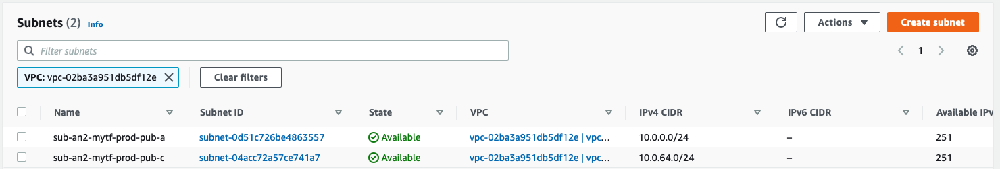

[toc]

# 0. !!

본 실습은 다음의 조건들이 필요합니다.

- 기본적인 AWS 지식(AWS VPC, Subnet, Internet-gateway, NAT-gateway, Route-table)
- 기본적인 Shell 사용 능력(`cd`, `pwd`, `mkdir`, `tree`, 등)
- Terrafrom CLI와 AWS CLI가 설치된 환경

Terraform을 활용하여 서울리전에 다음의 AWS 인프라를 순차적으로 생성하는 실습입니다.

- VPC (1)
- Subnets (Public2, Private2)
- Internet-gateway (1)
- NAT-gateway, EIP (1)
- Route-table (2)

# 1. 디렉토리 생성

임의의 디렉토리를 하나 생성하고 해당 경로에 쉘 프로그램을 실행시킵니다.

```bash
$ mkdir -p /Users/yunsang/Desktop/my-tf
$ cd /Users/yunsang/Desktop/my-tf
```

# 2. Terraform 코드 작성

생성한 디렉토리에 다음과 같이 코드를 작성 및 파일로 저장합니다.

```hcl
#
# 파일명 : provider.tf
#

# Terraform에서 지원하는 provider 중, AWS를 사용하겠다는 의미입니다.
provider "aws" {
  region  = "ap-northeast-2"
  profile = "default"
  # 프로파일을 사용하지 않는 경우 다음과 같이 access_key, secret_key를 기입해도 됩니다.
  # access_key = "" 
  # secret_key = ""
}
```

```hcl
#
# 파일명 : main.tf
#

# VPC(10.0.0.0/16)을 하나 생성합니다.
resource "aws_vpc" "this" {
  cidr_block           = "10.0.0.0/16"
  tags = {
      "Name" = "vpc-an2-mytf-prod"
  }
}

# Internet-gateway를 생성하고 위에서 생성한 VPC에 연결합니다.
resource "aws_internet_gateway" "this" {
  vpc_id = aws_vpc.this.id # 생성된 리소스에서 vpc id를 읽어옵니다.
  tags   = {
      "Name" = "igw-an2-mytf-prod"
  }
}

# Subnet(10.0.0.0/24)를 A-Zone에 하나 생성합니다.
resource "aws_subnet" "subnet1" {
  vpc_id            = aws_vpc.this.id # 생성된 리소스에서 vpc id를 읽어옵니다.
  availability_zone = "ap-northeast-2a"
  cidr_block        = "10.0.0.0/24"
  tags = {
      "Name" = "sub-an2-mytf-prod-pub-a"
  }
}

# Subnet(10.0.64.0/24)를 C-Zone에 하나 생성합니다.
resource "aws_subnet" "subnet2" {
  vpc_id            = aws_vpc.this.id # 생성된 리소스에서 vpc id를 읽어옵니다.
  availability_zone = "ap-northeast-2c"
  cidr_block        = "10.0.64.0/24"
  tags = {
      "Name" = "sub-an2-mytf-prod-pub-c"
  }
}

# 외부 통신을 Internet-gateway를 거치도록 Route-table을 생성합니다.
resource "aws_route_table" "rt" {
  vpc_id       = aws_vpc.this.id # 생성된 리소스에서 vpc id를 읽어옵니다.
  route {
    cidr_block = "0.0.0.0/0"
    gateway_id = aws_internet_gateway.this.id  # 생성된 리소스에서 internet-gw id를 읽어옵니다.
  }
  tags         = {
      "Name" = "rt-an2-mytf-prod-pub"
  }
}

# 생성한 Route-table에 Subnet을 연결합니다.
resource "aws_route_table_association" "subnet1" {
  subnet_id      = aws_subnet.subnet1.id # 생성된 리소스에서 subnet id를 읽어옵니다.
  route_table_id = aws_route_table.rt.id # 생성된 리소스에서 route-table id를 읽어옵니다.
}

# 생성한 Route-table에 Subnet을 연결합니다.
resource "aws_route_table_association" "subnet2" {
  subnet_id      = aws_subnet.subnet2.id # 생성된 리소스에서 subnet id를 읽어옵니다.
  route_table_id = aws_route_table.rt.id # 생성된 리소스에서 route-table id를 읽어옵니다.
}
```

```hcl
#
# 파일명 : output.tf
#

# Terraform의 plan, apply 과정에서 콘솔에 출력되는 값 입니다.
# 다양한 모듈을 사용하고 있다면, 해당 모듈의 출력값으로 참조가 가능합니다.

output "vpc_id" {
  description = "The id of the VPC"
  value       = aws_vpc.this.id
}

output "igw_gateway_id" {
  description = "The id of the internet gateway"
  value       = aws_internet_gateway.this.id
}

output "subnet1" {
  description = "The id of the subnet 1"
  value       = aws_subnet.subnet1.id
}

output "subnet2" {
  description = "The id of the subnet 2"
  value       = aws_subnet.subnet2.id
}

output "route-table-igw" {
  description = "The id of the route table for igw"
  value       = aws_route_table.rt.id
}
```

# 3. Terraform init

다음과 같이 파일이 저장되어 있음을 확인합니다.

```bash
$ pwd
/Users/yunsang/Desktop/my-tf

$ ls -al
-rw-r--r--   1 yunsang  staff  2153 Feb  2 10:32 main.tf
-rw-r--r--   1 yunsang  staff   561 Feb  2 10:32 output.tf
-rw-r--r--   1 yunsang  staff   327 Feb  2 10:32 provider.tf
```

`terraform init`을 실행합니다.

```bash
$ terraform init

Initializing the backend...

Initializing provider plugins...
- Finding latest version of hashicorp/aws...
- Installing hashicorp/aws v3.26.0...
- Installed hashicorp/aws v3.26.0 (signed by HashiCorp)

Terraform has created a lock file .terraform.lock.hcl to record the provider
selections it made above. Include this file in your version control repository
so that Terraform can guarantee to make the same selections by default when
you run "terraform init" in the future.

Terraform has been successfully initialized!

You may now begin working with Terraform. Try running "terraform plan" to see
any changes that are required for your infrastructure. All Terraform commands
should now work.

If you ever set or change modules or backend configuration for Terraform,
rerun this command to reinitialize your working directory. If you forget, other
commands will detect it and remind you to do so if necessary.
```

동일한 경로에 `.terraform` 디렉토리가 생성되며 구조는 다음과 같습니다.

```bash
$ tree .terraform
.terraform
└── providers
    └── registry.terraform.io
        └── hashicorp
            └── aws
                └── 3.26.0
                    └── darwin_amd64
                        └── terraform-provider-aws_v3.26.0_x5

6 directories, 1 file
```

`.terraform`에 적절한 파일들이 없으면 plan과 apply, destroy 진행 시에 에러를 발생시킵니다. 현재 코드에서는 외부 모듈 사용없이 AWS provider만 사용하기에  `terraform-provider-aws_v3.26.0_x5` 파일 하나만 다운로드됩니다.

# 4. Terraform plan

`terraform plan`을 실행합니다.

```bash
$ terraform plan

An execution plan has been generated and is shown below.
Resource actions are indicated with the following symbols:
  + create

Terraform will perform the following actions:

  # aws_internet_gateway.this will be created
  + resource "aws_internet_gateway" "this" {
      + arn      = (known after apply)
      + id       = (known after apply)
      + owner_id = (known after apply)
      + tags     = {
          + "Name" = "igw-an2-mytf-prod"
        }
      + vpc_id   = (known after apply)
    }

  # aws_route_table.rt will be created
  + resource "aws_route_table" "rt" {
      + id               = (known after apply)
      + owner_id         = (known after apply)
      + propagating_vgws = (known after apply)
      + route            = [
          + {
              + cidr_block                = "0.0.0.0/0"
              + egress_only_gateway_id    = ""
              + gateway_id                = (known after apply)
              + instance_id               = ""
              + ipv6_cidr_block           = ""
              + local_gateway_id          = ""
              + nat_gateway_id            = ""
              + network_interface_id      = ""
              + transit_gateway_id        = ""
              + vpc_endpoint_id           = ""
              + vpc_peering_connection_id = ""
            },
        ]
      + tags             = {
          + "Name" = "rt-an2-mytf-prod-pub"
        }
      + vpc_id           = (known after apply)
    }

  # aws_route_table_association.subnet1 will be created
  + resource "aws_route_table_association" "subnet1" {
      + id             = (known after apply)
      + route_table_id = (known after apply)
      + subnet_id      = (known after apply)
    }

  # aws_route_table_association.subnet2 will be created
  + resource "aws_route_table_association" "subnet2" {
      + id             = (known after apply)
      + route_table_id = (known after apply)
      + subnet_id      = (known after apply)
    }

  # aws_subnet.subnet1 will be created
  + resource "aws_subnet" "subnet1" {
      + arn                             = (known after apply)
      + assign_ipv6_address_on_creation = false
      + availability_zone               = "ap-northeast-2a"
      + availability_zone_id            = (known after apply)
      + cidr_block                      = "10.0.0.0/24"
      + id                              = (known after apply)
      + ipv6_cidr_block_association_id  = (known after apply)
      + map_public_ip_on_launch         = false
      + owner_id                        = (known after apply)
      + tags                            = {
          + "Name" = "newtags"
        }
      + vpc_id                          = (known after apply)
    }

  # aws_subnet.subnet2 will be created
  + resource "aws_subnet" "subnet2" {
      + arn                             = (known after apply)
      + assign_ipv6_address_on_creation = false
      + availability_zone               = "ap-northeast-2c"
      + availability_zone_id            = (known after apply)
      + cidr_block                      = "10.0.64.0/24"
      + id                              = (known after apply)
      + ipv6_cidr_block_association_id  = (known after apply)
      + map_public_ip_on_launch         = false
      + owner_id                        = (known after apply)
      + tags                            = {
          + "Name" = "sub-an2-mytf-prod-pub-c"
        }
      + vpc_id                          = (known after apply)
    }

  # aws_vpc.this will be created
  + resource "aws_vpc" "this" {
      + arn                              = (known after apply)
      + assign_generated_ipv6_cidr_block = false
      + cidr_block                       = "10.0.0.0/16"
      + default_network_acl_id           = (known after apply)
      + default_route_table_id           = (known after apply)
      + default_security_group_id        = (known after apply)
      + dhcp_options_id                  = (known after apply)
      + enable_classiclink               = (known after apply)
      + enable_classiclink_dns_support   = (known after apply)
      + enable_dns_hostnames             = (known after apply)
      + enable_dns_support               = true
      + id                               = (known after apply)
      + instance_tenancy                 = "default"
      + ipv6_association_id              = (known after apply)
      + ipv6_cidr_block                  = (known after apply)
      + main_route_table_id              = (known after apply)
      + owner_id                         = (known after apply)
      + tags                             = {
          + "Name" = "vpc-an2-mytf-prod"
        }
    }

Plan: 7 to add, 0 to change, 0 to destroy.

Changes to Outputs:
  + igw_gateway_id  = (known after apply)
  + route-table-igw = (known after apply)
  + subnet1         = (known after apply)
  + subnet2         = (known after apply)
  + vpc_id          = (known after apply)

------------------------------------------------------------------------

Note: You didn't specify an "-out" parameter to save this plan, so Terraform
can't guarantee that exactly these actions will be performed if
"terraform apply" is subsequently run.
```

현재 코드를 인프라에 적용했을 때, 어떻게 인프라 형상이 변화될지에 대한 결과값입니다. terraform을 통한 인프라 최초 구축이기에 AWS 리소스가 7개 추가되는 결과값이 나왔습니다.

하단의 `Changes to Outputs`에는 `output.tf`에 정의한 output값들이 값들의 변화값을 표현합니다. 현재는 `state` 파일에 관련된 정보가 없는 최초 실행이므로  변화되는 내용없이 단순히 추가된다고 표현되고 있습니다.

주의할 점은, `plan`의 결과값은 단순하게 코드 분석을 통해 계산한 결과값이지, 뒤이어 진행될 `apply` 과정이 문제 없이 진행됨을 보장하지 않습니다.

# 5. terraform apply

`terraform apply`를 통해 인프라에 리소스를 생성합니다.

```bash
$ terraform apply

...생략 (Plan 과정과 출력내용이 동일합니다.)

Do you want to perform these actions?
  Terraform will perform the actions described above.
  Only 'yes' will be accepted to approve.

  Enter a value: yes # yes를 입력합니다.

aws_vpc.this: Creating...
aws_vpc.this: Creation complete after 2s [id=vpc-02ba3a951db5df12e]
aws_internet_gateway.this: Creating...
aws_subnet.subnet1: Creating...
aws_subnet.subnet2: Creating...
aws_subnet.subnet1: Creation complete after 1s [id=subnet-0d51c726be4863557]
aws_subnet.subnet2: Creation complete after 1s [id=subnet-04acc72a57ce741a7]
aws_internet_gateway.this: Creation complete after 1s [id=igw-02e665dbc21caee6a]
aws_route_table.rt: Creating...
aws_route_table.rt: Creation complete after 1s [id=rtb-056a4278563a01741]
aws_route_table_association.subnet1: Creating...
aws_route_table_association.subnet2: Creating...
aws_route_table_association.subnet1: Creation complete after 0s [id=rtbassoc-029526584c3ed2e6f]
aws_route_table_association.subnet2: Creation complete after 0s [id=rtbassoc-0f34e933db1a3259b]

Apply complete! Resources: 7 added, 0 changed, 0 destroyed.

Outputs:

igw_gateway_id = "igw-02e665dbc21caee6a"
route-table-igw = "rtb-056a4278563a01741"
subnet1 = "subnet-0d51c726be4863557"
subnet2 = "subnet-04acc72a57ce741a7"
vpc_id = "vpc-02ba3a951db5df12e"
```

`output.tf`에 정의한 output값들이 출력됩니다. 이 처럼 하나의 모듈이 완료가 되면 모든 output 값들이 출력되며 이 값은 다른 모듈에서 참조해서 사용될 수 도 있습니다.

그리고 동일한 경로에 `state` 파일이 생성되었음을 확인할 수 있습니다. `state` 파일은 JSON 타입의 데이터임을 확인할 수가 있습니다.

```bash
$ ls -al
drwxr-xr-x   3 yunsang  staff    96 Feb  2 10:34 .terraform
-rwxrwxrwx   1 yunsang  staff  1002 Feb  2 10:34 .terraform.lock.hcl
-rw-r--r--   1 yunsang  staff  2804 Feb  2 10:59 main.tf
-rw-r--r--   1 yunsang  staff   557 Feb  2 10:43 output.tf
-rw-r--r--   1 yunsang  staff   327 Feb  2 10:32 provider.tf
**-rw-r--r--   1 yunsang  staff  7870 Feb  2 10:50 terraform.tfstate**

$ file terraform.tfstate
terraform.tfstate: JSON data
```

AWS Console에서 생성된 리소스를 확인합니다.





# 6. 코드 수정 적용

다음과 같이 `main.tf`에 Private Subnet 2개를 생성하고 NAT 게이트웨이를 통해 라우팅되도록 코드를 추가합니다.

```hcl
# Subnet(10.0.128.0/24)를 A-Zone에 하나 생성합니다.
resource "aws_subnet" "subnet3" {
  vpc_id            = aws_vpc.this.id # 생성된 리소스에서 vpc id를 읽어옵니다.
  availability_zone = "ap-northeast-2a"
  cidr_block        = "10.0.128.0/24"
  tags = {
      "Name" = "sub-an2-mytf-prod-pri-a"
  }
}

# Subnet(10.0.192.0/24)를 C-Zone에 하나 생성합니다.
resource "aws_subnet" "subnet4" {
  vpc_id            = aws_vpc.this.id # 생성된 리소스에서 vpc id를 읽어옵니다.
  availability_zone = "ap-northeast-2c"
  cidr_block        = "10.0.192.0/24"
  tags = {
      "Name" = "sub-an2-mytf-prod-pri-c"
  }
}

# NAT 게이트웨이를 subnet1(Public)에 생성합니다.
resource "aws_nat_gateway" "this" {
  subnet_id     = aws_subnet.subnet1.id
  allocation_id = aws_eip.nat.id
  tags = {
    "Name" = "nat-an2-mytf-prod-a"
  }
}

# NAT 게이트웨이를 위해 EIP를 하나 생성합니다.
resource "aws_eip" "nat" {
  vpc      = true
  tags = {
    "Name" = "eip-an2-mytf-prod-nat"
  }
}

# 외부 통신을 NAT 게이트웨이를 거치도록 Route-table을 생성합니다.
resource "aws_route_table" "rt2" {
  vpc_id       = aws_vpc.this.id # 생성된 리소스에서 vpc id를 읽어옵니다.
  route {
    cidr_block = "0.0.0.0/0"
    gateway_id = aws_nat_gateway.this.id  # 생성된 리소스에서 NAT 게이트웨이 id를 읽어옵니다.
  }
  tags         = {
      "Name" = "rt-an2-mytf-prod-pri"
  }
}

# 생성한 Route-table에 Subnet을 연결합니다.
resource "aws_route_table_association" "subnet3" {
  subnet_id      = aws_subnet.subnet3.id # 생성된 리소스에서 subnet id를 읽어옵니다.
  route_table_id = aws_route_table.rt2.id # 생성된 리소스에서 route-table id를 읽어옵니다.
}

# 생성한 Route-table에 Subnet을 연결합니다.
resource "aws_route_table_association" "subnet4" {
  subnet_id      = aws_subnet.subnet4.id # 생성된 리소스에서 subnet id를 읽어옵니다.
  route_table_id = aws_route_table.rt2.id # 생성된 리소스에서 route-table id를 읽어옵니다.
}
```

다음과 같이 `main.tf`의 Subnet1의 Tag를 일부분을 수정합니다.

```hcl
# Subnet(10.0.0.0/24)를 A-Zone에 하나 생성합니다.
resource "aws_subnet" "subnet1" {
  vpc_id            = aws_vpc.this.id # 생성된 리소스에서 vpc id를 읽어옵니다.
  availability_zone = "ap-northeast-2a"
  cidr_block        = "10.0.0.0/24"
  **tags = {
      "Name" = "newtags" # 기존의 값은 `sub-an2-mytf-prod-pub-a` 입니다
  }**
}
```

다음과 같이 `output.tf`에 위에서 추가한 리소스에 대한 정보를 추가합니다.

```hcl
output "subnet3" {
  description = "The id of the subnet 3"
  value       = aws_subnet.subnet3.id
}

output "subnet4" {
  description = "The id of the subnet 4"
  value       = aws_subnet.subnet4.id
}

output "route-table-nat" {
  description = "The id of the route table for NAT"
  value       = aws_route_table.rt2.id
}
```

`terraform plan`을 수행하면 `state` 파일에서 기존의 인프라 형상과 작성된 코드를 비교하여 어떤 리소스가 추가로 생성되고 수정되는지 계산합니다.

```bash
$ terraform plan
aws_vpc.this: Refreshing state... [id=vpc-02ba3a951db5df12e]
aws_internet_gateway.this: Refreshing state... [id=igw-02e665dbc21caee6a]
aws_subnet.subnet2: Refreshing state... [id=subnet-04acc72a57ce741a7]
aws_subnet.subnet1: Refreshing state... [id=subnet-0d51c726be4863557]
aws_route_table.rt: Refreshing state... [id=rtb-056a4278563a01741]
aws_route_table_association.subnet1: Refreshing state... [id=rtbassoc-029526584c3ed2e6f]
aws_route_table_association.subnet2: Refreshing state... [id=rtbassoc-0f34e933db1a3259b]

An execution plan has been generated and is shown below.
Resource actions are indicated with the following symbols:
  + create
  ~ update in-place

Terraform will perform the following actions:

  # aws_eip.nat will be created
  + resource "aws_eip" "nat" {
      + allocation_id        = (known after apply)
      + association_id       = (known after apply)
      + carrier_ip           = (known after apply)
      + customer_owned_ip    = (known after apply)
      + domain               = (known after apply)
      + id                   = (known after apply)
      + instance             = (known after apply)
      + network_border_group = (known after apply)
      + network_interface    = (known after apply)
      + private_dns          = (known after apply)
      + private_ip           = (known after apply)
      + public_dns           = (known after apply)
      + public_ip            = (known after apply)
      + public_ipv4_pool     = (known after apply)
      + tags                 = {
          + "Name" = "eip-an2-mytf-prod-nat"
        }
      + vpc                  = true
    }

  # aws_nat_gateway.this will be created
  + resource "aws_nat_gateway" "this" {
      + allocation_id        = (known after apply)
      + id                   = (known after apply)
      + network_interface_id = (known after apply)
      + private_ip           = (known after apply)
      + public_ip            = (known after apply)
      + subnet_id            = "subnet-0d51c726be4863557"
      + tags                 = {
          + "Name" = "nat-an2-mytf-prod-a"
        }
    }

  # aws_route_table.rt2 will be created
  + resource "aws_route_table" "rt2" {
      + id               = (known after apply)
      + owner_id         = (known after apply)
      + propagating_vgws = (known after apply)
      + route            = [
          + {
              + cidr_block                = "0.0.0.0/0"
              + egress_only_gateway_id    = ""
              + gateway_id                = (known after apply)
              + instance_id               = ""
              + ipv6_cidr_block           = ""
              + local_gateway_id          = ""
              + nat_gateway_id            = ""
              + network_interface_id      = ""
              + transit_gateway_id        = ""
              + vpc_endpoint_id           = ""
              + vpc_peering_connection_id = ""
            },
        ]
      + tags             = {
          + "Name" = "rt-an2-mytf-prod-pri"
        }
      + vpc_id           = "vpc-02ba3a951db5df12e"
    }

  # aws_route_table_association.subnet3 will be created
  + resource "aws_route_table_association" "subnet3" {
      + id             = (known after apply)
      + route_table_id = (known after apply)
      + subnet_id      = (known after apply)
    }

  # aws_route_table_association.subnet4 will be created
  + resource "aws_route_table_association" "subnet4" {
      + id             = (known after apply)
      + route_table_id = (known after apply)
      + subnet_id      = (known after apply)
    }

  # aws_subnet.subnet1 will be updated in-place
  ~ resource "aws_subnet" "subnet1" {
        id                              = "subnet-0d51c726be4863557"
      ~ tags                            = {
          ~ "Name" = "sub-an2-mytf-prod-pub-a" -> "newtags"
        }
        # (8 unchanged attributes hidden)
    }

  # aws_subnet.subnet3 will be created
  + resource "aws_subnet" "subnet3" {
      + arn                             = (known after apply)
      + assign_ipv6_address_on_creation = false
      + availability_zone               = "ap-northeast-2a"
      + availability_zone_id            = (known after apply)
      + cidr_block                      = "10.0.128.0/24"
      + id                              = (known after apply)
      + ipv6_cidr_block_association_id  = (known after apply)
      + map_public_ip_on_launch         = false
      + owner_id                        = (known after apply)
      + tags                            = {
          + "Name" = "sub-an2-mytf-prod-pri-a"
        }
      + vpc_id                          = "vpc-02ba3a951db5df12e"
    }

  # aws_subnet.subnet4 will be created
  + resource "aws_subnet" "subnet4" {
      + arn                             = (known after apply)
      + assign_ipv6_address_on_creation = false
      + availability_zone               = "ap-northeast-2c"
      + availability_zone_id            = (known after apply)
      + cidr_block                      = "10.0.192.0/24"
      + id                              = (known after apply)
      + ipv6_cidr_block_association_id  = (known after apply)
      + map_public_ip_on_launch         = false
      + owner_id                        = (known after apply)
      + tags                            = {
          + "Name" = "sub-an2-mytf-prod-pri-c"
        }
      + vpc_id                          = "vpc-02ba3a951db5df12e"
    }

**Plan: 7 to add, 1 to change, 0 to destroy.**

------------------------------------------------------------------------

Note: You didn't specify an "-out" parameter to save this plan, so Terraform
can't guarantee that exactly these actions will be performed if
"terraform apply" is subsequently run.
```

`terraform apply`을 수행합니다.

```bash
$ terraform apply

...생략 (Plan 과정과 출력내용이 동일합니다.)

Do you want to perform these actions?
  Terraform will perform the actions described above.
  Only 'yes' will be accepted to approve.

  Enter a value: yes # yes를 입력합니다.

aws_subnet.subnet3: Creating...
aws_eip.nat: Creating...
aws_subnet.subnet4: Creating...
aws_subnet.subnet1: Modifying... [id=subnet-0d51c726be4863557]
aws_subnet.subnet1: Modifications complete after 1s [id=subnet-0d51c726be4863557]
aws_eip.nat: Creation complete after 1s [id=eipalloc-0519f9e0420437fc1]
aws_nat_gateway.this: Creating...
aws_subnet.subnet3: Creation complete after 1s [id=subnet-0c02c4e79479fef6e]
aws_subnet.subnet4: Creation complete after 1s [id=subnet-03e3775bcad41f36e]
aws_nat_gateway.this: Still creating... [10s elapsed]
aws_nat_gateway.this: Still creating... [20s elapsed]
aws_nat_gateway.this: Still creating... [30s elapsed]
aws_nat_gateway.this: Still creating... [40s elapsed]
aws_nat_gateway.this: Still creating... [50s elapsed]
aws_nat_gateway.this: Still creating... [1m0s elapsed]
aws_nat_gateway.this: Still creating... [1m10s elapsed]
aws_nat_gateway.this: Still creating... [1m20s elapsed]
aws_nat_gateway.this: Still creating... [1m30s elapsed]
aws_nat_gateway.this: Still creating... [1m40s elapsed]
aws_nat_gateway.this: Creation complete after 1m46s [id=nat-022e1fc4492305f2c]
aws_route_table.rt2: Creating...
aws_route_table.rt2: Creation complete after 1s [id=rtb-0be9850f5bda3d008]
aws_route_table_association.subnet4: Creating...
aws_route_table_association.subnet3: Creating...
aws_route_table_association.subnet4: Creation complete after 0s [id=rtbassoc-0d24cb264107095b6]
aws_route_table_association.subnet3: Creation complete after 0s [id=rtbassoc-04e7b29e9d60dea86]

Apply complete! Resources: 7 added, 1 changed, 0 destroyed.

Outputs:

igw_gateway_id = "igw-02e665dbc21caee6a"
route-table-igw = "rtb-056a4278563a01741"
route-table-nat = "rtb-0be9850f5bda3d008"
subnet1 = "subnet-0d51c726be4863557"
subnet2 = "subnet-04acc72a57ce741a7"
subnet3 = "subnet-0c02c4e79479fef6e"
subnet4 = "subnet-03e3775bcad41f36e"
vpc_id = "vpc-02ba3a951db5df12e"
```

# 7. state 파일에 대한 분석

생성된 `state` 파일의 JSON 포맷이며 기본적인 구성은 다음과 같습니다.

```json
{
  "version": 4,
  "terraform_version": "0.14.5",
  "serial": 50,
  "lineage": "d6cb41e6-1320-8eab-d654-a7e50f307907",
  "outputs": {
    "...": { ... },
  },
  "resources": [
    { ... },
  ]
}
```

- `version`은 해당 state 파일이 가지는 구조의 버전입니다.
- `terraform_version`에서 명시되어 있는 것과 다른 버전의 terraform cli을 사용하게 되면 에러가 발생합니다.

    ```bash
    # 0.14.5으로 생성된 state 파일을 0.14.4에서 참조할 시 에러 발생 
    Error refreshing state: \
     state snapshot was created by Terraform v0.14.5, \
     which is newer than current v0.14.4; \
     upgrade to Terraform v0.14.5 or greater to work with this state
    ```

- `serial` 값은 내용이 바뀔 때 마다 1씩 증가하는 값입니다.

     `state` 파일 수작업으로 작업하고 원격지에 업로드(push) 할 때, 원격지보다 값이 작다면 수정하는 과정에서 이미 형상의 변경이 일어났음을 의미합니다.

- `lineage`는 `state` 파일이 생성될 때 부여되는 고유한 값입니다. 해당 값이 다르다면 `state` 파일의 무결성을 의심해야합니다.
- `outputs`은 해당 모듈의 output의 결과값입니다.
- `resources`는 해당 모듈이 생성한 모든 리소스 정보입니다.

# 8. terraform destroy

생성된 리소스를 제거하기 위해 `terraform destroy`를 수행합니다. `state` 파일을 참조하여 어떤 리소스들이 삭제되는지 출력되며 프롬프트에 `yes`를 입력하면 종속성에 맞춰 순차적으로 삭제됩니다.

```bash
$ terraform destroy

An execution plan has been generated and is shown below.
Resource actions are indicated with the following symbols:
  - destroy

Terraform will perform the following actions:

  # aws_internet_gateway.this will be destroyed
  - resource "aws_internet_gateway" "this" {
      - arn      = "arn:aws:ec2:ap-northeast-2:703507686712:internet-gateway/igw-0ae1668e882d98732" -> null
      - id       = "igw-0ae1668e882d98732" -> null
      - owner_id = "703507686712" -> null
      - tags     = {
          - "Name" = "igw-an2-mytf-prod"
        } -> null
      - vpc_id   = "vpc-0598545c06b849cad" -> null
    }

  # aws_route_table.rt will be destroyed
  - resource "aws_route_table" "rt" {
      - id               = "rtb-035a2670d221408d1" -> null
      - owner_id         = "703507686712" -> null
      - propagating_vgws = [] -> null
      - route            = [
          - {
              - cidr_block                = "0.0.0.0/0"
              - egress_only_gateway_id    = ""
              - gateway_id                = "igw-0ae1668e882d98732"
              - instance_id               = ""
              - ipv6_cidr_block           = ""
              - local_gateway_id          = ""
              - nat_gateway_id            = ""
              - network_interface_id      = ""
              - transit_gateway_id        = ""
              - vpc_endpoint_id           = ""
              - vpc_peering_connection_id = ""
            },
        ] -> null
      - tags             = {
          - "Name" = "rt-an2-mytf-prod-pub"
        } -> null
      - vpc_id           = "vpc-0598545c06b849cad" -> null
    }

  # aws_route_table_association.subnet1 will be destroyed
  - resource "aws_route_table_association" "subnet1" {
      - id             = "rtbassoc-02e418d7a620950d7" -> null
      - route_table_id = "rtb-035a2670d221408d1" -> null
      - subnet_id      = "subnet-0f36ee9c52b86b8e6" -> null
    }

  # aws_route_table_association.subnet2 will be destroyed
  - resource "aws_route_table_association" "subnet2" {
      - id             = "rtbassoc-0951f5ac27cff3f8b" -> null
      - route_table_id = "rtb-035a2670d221408d1" -> null
      - subnet_id      = "subnet-0c767c88abd101953" -> null
    }

  # aws_subnet.subnet1 will be destroyed
  - resource "aws_subnet" "subnet1" {
      - arn                             = "arn:aws:ec2:ap-northeast-2:703507686712:subnet/subnet-0f36ee9c52b86b8e6" -> null
      - assign_ipv6_address_on_creation = false -> null
      - availability_zone               = "ap-northeast-2a" -> null
      - availability_zone_id            = "apne2-az1" -> null
      - cidr_block                      = "10.0.0.0/24" -> null
      - id                              = "subnet-0f36ee9c52b86b8e6" -> null
      - map_public_ip_on_launch         = false -> null
      - owner_id                        = "703507686712" -> null
      - tags                            = {
          - "Name" = "sub-an2-mytf-prod-pub-a"
        } -> null
      - vpc_id                          = "vpc-0598545c06b849cad" -> null
    }

  # aws_subnet.subnet2 will be destroyed
  - resource "aws_subnet" "subnet2" {
      - arn                             = "arn:aws:ec2:ap-northeast-2:703507686712:subnet/subnet-0c767c88abd101953" -> null
      - assign_ipv6_address_on_creation = false -> null
      - availability_zone               = "ap-northeast-2c" -> null
      - availability_zone_id            = "apne2-az3" -> null
      - cidr_block                      = "10.0.64.0/24" -> null
      - id                              = "subnet-0c767c88abd101953" -> null
      - map_public_ip_on_launch         = false -> null
      - owner_id                        = "703507686712" -> null
      - tags                            = {
          - "Name" = "sub-an2-mytf-prod-pub-c"
        } -> null
      - vpc_id                          = "vpc-0598545c06b849cad" -> null
    }

  # aws_vpc.this will be destroyed
  - resource "aws_vpc" "this" {
      - arn                              = "arn:aws:ec2:ap-northeast-2:703507686712:vpc/vpc-0598545c06b849cad" -> null
      - assign_generated_ipv6_cidr_block = false -> null
      - cidr_block                       = "10.0.0.0/16" -> null
      - default_network_acl_id           = "acl-0225982a13b0d6cd5" -> null
      - default_route_table_id           = "rtb-00816bfdeaac7aed7" -> null
      - default_security_group_id        = "sg-0949227ab3f52939f" -> null
      - dhcp_options_id                  = "dopt-8b2ba6e0" -> null
      - enable_dns_hostnames             = false -> null
      - enable_dns_support               = true -> null
      - id                               = "vpc-0598545c06b849cad" -> null
      - instance_tenancy                 = "default" -> null
      - main_route_table_id              = "rtb-00816bfdeaac7aed7" -> null
      - owner_id                         = "703507686712" -> null
      - tags                             = {
          - "Name" = "vpc-an2-mytf-prod"
        } -> null
    }

Plan: 0 to add, 0 to change, 7 to destroy.

Changes to Outputs:
  - igw_gateway_id = "igw-0ae1668e882d98732" -> null
  - route-table    = "rtb-035a2670d221408d1" -> null
  - subnet1        = "subnet-0f36ee9c52b86b8e6" -> null
  - subnet2        = "subnet-0c767c88abd101953" -> null
  - vpc_id         = "vpc-0598545c06b849cad" -> null

Do you really want to destroy all resources?
  Terraform will destroy all your managed infrastructure, as shown above.
  There is no undo. Only 'yes' will be accepted to confirm.

  **Enter a value: yes**

aws_route_table_association.subnet1: Destroying... [id=rtbassoc-02e418d7a620950d7]
aws_route_table_association.subnet2: Destroying... [id=rtbassoc-0951f5ac27cff3f8b]
aws_route_table_association.subnet1: Destruction complete after 0s
aws_route_table_association.subnet2: Destruction complete after 0s
aws_subnet.subnet2: Destroying... [id=subnet-0c767c88abd101953]
aws_subnet.subnet1: Destroying... [id=subnet-0f36ee9c52b86b8e6]
aws_route_table.rt: Destroying... [id=rtb-035a2670d221408d1]
aws_subnet.subnet1: Destruction complete after 1s
aws_subnet.subnet2: Destruction complete after 1s
aws_route_table.rt: Destruction complete after 1s
aws_internet_gateway.this: Destroying... [id=igw-0ae1668e882d98732]
aws_internet_gateway.this: Still destroying... [id=igw-0ae1668e882d98732, 10s elapsed]
aws_internet_gateway.this: Destruction complete after 10s
aws_vpc.this: Destroying... [id=vpc-0598545c06b849cad]
aws_vpc.this: Destruction complete after 1s

Destroy complete! Resources: 7 destroyed.
```

Terraform을 활용한 기본적인 인프라 생성 및 수정, 삭제까지 실습완료했습니다.